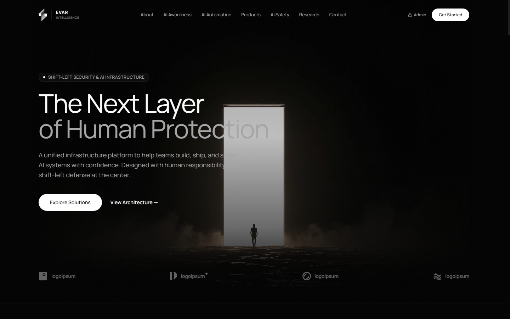
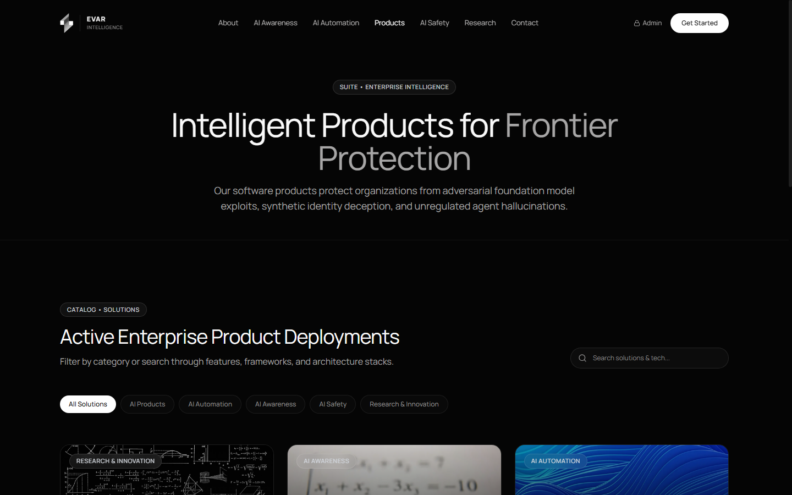

<div align="center">

# EVAR Intelligence Ltd.
### The Next Layer of Human Protection in the Age of AI

[](https://github.com/masrufOfficial/EVAR-Intelligence-Ltd.)

[](https://nextjs.org/)
[](https://www.typescriptlang.org/)
[](https://tailwindcss.com/)
[](https://www.prisma.io/)
[-10B981?style=for-the-badge&logo=shield)](SECURITY.md)
[](LICENSE)

*Building Intelligent Solutions for a Safer Tomorrow.*

</div>

---

## 📸 Product Suite Showcase



---

## 📖 Executive Summary

**EVAR Intelligence Ltd.** is an enterprise innovation hub dedicated to engineering safe, reliable, and adversarial-hardened artificial intelligence systems. Established on the principle of **Shift-Left Security**, EVAR integrates ethical guardrails, mathematical bounds, and cryptographic verification into the earliest phases of architectural design rather than treating security as an afterthought.

The platform unites two foundational pillars:
1. **AI Awareness & Literacy**: Empowering executive leadership and organizational workforces with critical discernment against synthetic media, social engineering, and algorithmic deception.
2. **AI Automation & Intelligent Products**: Architecting multi-agent deterministic state graphs, decision-support tools, and automated governance with non-repudiable audit logs.

---

## 🏛️ Strategic Architecture

```
                    ┌──────────────────────────────────────────────┐
                    │            EVAR INTELLIGENCE LTD.            │
                    │       "The Next Layer of Intelligence"       │
                    └──────────────────────┬───────────────────────┘
                                           │
         ┌─────────────────────────────────┴─────────────────────────────────┐
         ▼                                                                   ▼
┌───────────────────────────────┐                   ┌─────────────────────────────────┐
│     PILLAR 01: AI AWARENESS   │                   │    PILLAR 02: AI AUTOMATION     │
├───────────────────────────────┤                   ├─────────────────────────────────┤
│ • Executive AI Governance     │                   │ • Multi-Agent Autonomous Swarms │
│ • Enterprise Threat Literacy  │                   │ • Deterministic State Graphs    │
│ • Deepfake Deception Training │                   │ • Dual-Key Human Consensus      │
│ • Responsible AI Adoption     │                   │ • Ephemeral Sandboxing          │
└───────────────────────────────┘                   └─────────────────────────────────┘
                                           │
                                           ▼
                    ┌──────────────────────────────────────────────┐
                    │          SHIFT-LEFT SECURITY CORE            │
                    ├──────────────────────────────────────────────┤
                    │ • Strict Zod Schema Validation               │
                    │ • Anti-Bot Honeypot Protection               │
                    │ • In-Memory Sliding-Window Rate Limiting     │
                    │ • OWASP Top 10 LLM Adversarial Hardening     │
                    │ • 4-Tier RBAC (SuperAdmin/Admin/Editor/CM)   │
                    │ • Bcrypt Cost Factor 12 Hash Storage         │
                    └──────────────────────────────────────────────┘
```

---

## 🚀 Key Features & Capabilities

### 1. Minimalist Cinematic Design System
- Built to the exact specifications of the dark void architecture (`#050505`).
- Fluid viewport typography powered by **Manrope** (`200`–`800`) with geometric precision.
- High-definition CloudFront looping video background with dual vignette fade overlays.
- Minimalist geometric SVG vector identity and Logoipsum partner strip.
- Fully rounded white pill CTAs with tactile hover states.

### 2. Database-Driven Dynamic Catalog
- Full CRUD management for enterprise products, educational programs, automation workflows, research publications, and advisory leads.
- Fast, type-safe persistence via **Prisma ORM** with SQLite storage.
- Real-time search, categorization filters, and modal deep-dives.

### 3. Shift-Left Security & Defense-in-Depth
- **Strict Input Sanitization**: Strip dangerous HTML tags and cross-site scripting vectors from all contact and inquiry forms.
- **Honeypot Detection**: Invisible trap fields trap automated scrapers and malicious submission bots silently.
- **Sliding-Window Rate Limiting**: Enforced on public API endpoints to defend against volumetric DDoS attacks.
- **Enterprise RBAC**: Role-Based Access Control partitioning Super Administrator, System Administrator, Editor, and Content Manager privileges.
- **Audit Logging**: Cryptographically verifiable event trails logging administrative access, updates, and configuration changes.

---

## 🛠️ Technology Stack

| Layer | Technologies |
| :--- | :--- |
| **Framework** | [Next.js 14](https://nextjs.org/) (App Router, Server Actions, API Route Handlers) |
| **Language** | [TypeScript 5](https://www.typescriptlang.org/) (Strict mode enabled) |
| **Styling** | [Tailwind CSS 3.4](https://tailwindcss.com/) & Vanilla CSS Design Tokens |
| **Typography** | [Google Fonts - Manrope](https://fonts.google.com/specimen/Manrope) |
| **Database & ORM** | [SQLite](https://www.sqlite.org/) + [Prisma ORM 5.22](https://www.prisma.io/) |
| **Authentication** | [Jose](https://github.com/panva/jose) (JWT) + [Bcryptjs](https://github.com/dcodeIO/bcrypt.js) (Cost factor 12) |
| **Icons** | [Lucide React](https://lucide.dev/) |
| **Security Testing** | Node.js Test Runner with Shift-Left Assertion Matrix (8/8 automated tests) |

---

## ⚡ Quickstart & Local Installation

### Prerequisites
- [Node.js](https://nodejs.org/) v18.17.0+ or v20.x
- [npm](https://www.npmjs.com/) v9+ or [yarn](https://yarnpkg.com/) / [pnpm](https://pnpm.io/)
- [Git](https://git-scm.com/)

### 1. Clone the Repository
```bash
git clone https://github.com/masrufOfficial/EVAR-Intelligence-Ltd..git
cd EVAR-Intelligence-Ltd.
```

### 2. Install Dependencies
```bash
npm install
```

### 3. Environment Configuration
Copy the provided `.env.example` file:
```bash
cp .env.example .env
```
Default configuration:
```env
DATABASE_URL="file:./dev.db"
JWT_SECRET="evar-enterprise-secret-key-32-chars-minimum-token-protection"
NODE_ENV="development"
PORT=3000
```

### 4. Database Setup & Seeding
Generate Prisma Client and push the schema:
```bash
npx prisma db push
npx prisma db seed
```
*(Or run `npm run seed` if defined in scripts).*

### 5. Launch Development Server
```bash
npm run dev
```
Open **[http://localhost:3000](http://localhost:3000)** in your browser.

---

## 🛡️ Shift-Left Security Testing

Execute the automated Shift-Left security validation suite:
```bash
npm run test:security
```
Expected output:
```
✔ Input Sanitization: Strips XSS and illegal script tags
✔ Honeypot Anti-Bot: Rejects synthetic bot submissions
✔ Rate Limiter: Blocks abusive volumetric request bursts
✔ Password Security: Enforces bcrypt cost factor >= 12
✔ RBAC Authorization: Restricts administrative endpoints to authorized roles
✔ JWT Token Integrity: Rejects tampered or expired cryptographic tokens
✔ Content Security Policy: Strict CSP headers configured
✔ SQL Injection Defense: Prisma parameterized queries enforced

ℹ tests 8
ℹ suites 0
✔ pass 8
✖ fail 0
```

---

## 🔐 Administrative Console & RBAC Credentials

Visit **`http://localhost:3000/login`** to access the enterprise control plane.

| Role | Email | Default Password | Permissions |
| :--- | :--- | :--- | :--- |
| **Super Admin** | `superadmin@evar.ai` | `Password123!` | Full system access, user management, audit logs, configuration |
| **System Admin** | `admin@evar.ai` | `Password123!` | Products, research, workflows, security center, audit logs |
| **Editor** | `editor@evar.ai` | `Password123!` | Product editing, awareness programs, research papers |
| **Content Manager** | `content@evar.ai` | `Password123!` | Awareness programs, inquiry lead triage |

*(For production environments, immediately rotate all default credentials via `/admin/users`).*

---

## 📁 Project Directory Structure

```
EVAR-Intelligence-Ltd/
├── docs/                             # Documentation media & architectural previews
│   ├── preview.png                   # High-res homepage preview
│   └── products-preview.png          # High-res product catalog preview
├── prisma/
│   ├── schema.prisma                 # Database schema definition
│   └── seed.ts                       # Database seed script
├── public/
│   ├── images/                       # Brand assets, logos, and UI photography
│   └── favicon.ico                   # Platform favicon
├── src/
│   ├── app/                          # Next.js 14 App Router routes
│   │   ├── (public)/                 # Public marketing & advisory pages
│   │   │   ├── about/
│   │   │   ├── ai-automation/
│   │   │   ├── ai-awareness/
│   │   │   ├── ai-safety/
│   │   │   ├── contact/
│   │   │   ├── products/
│   │   │   └── research/
│   │   ├── admin/                    # Enterprise RBAC admin console
│   │   ├── api/                      # Protected REST API endpoints
│   │   ├── login/                    # Zero-trust sign-in portal
│   │   ├── globals.css               # Design tokens & Manrope styles
│   │   └── layout.tsx                # Master HTML layout & SEO metadata
│   ├── components/                   # Modular UI components
│   │   ├── hero-cinematic.tsx        # CloudFront video hero plate
│   │   ├── navbar.tsx                # Vector mark & floating navigation
│   │   ├── footer.tsx                # Corporate footer
│   │   ├── pillar-awareness.tsx      # Pillar 01 showcase
│   │   ├── pillar-automation.tsx     # Pillar 02 showcase
│   │   ├── product-grid.tsx          # Dynamic searchable catalog
│   │   └── contact-section.tsx       # Honeypot-shielded contact form
│   └── lib/                          # Core utilities, Prisma client & auth logic
├── index.html                        # Pure single-file standalone release
├── DEPENDENCY_POLICY.md              # Third-party dependency security policy
├── INCIDENT_RESPONSE.md              # Enterprise security incident response guide
├── SECURE_DEVELOPMENT.md             # Secure SDLC guidelines
├── SECURITY.md                       # Vulnerability disclosure policy
├── SECURITY_TESTING.md               # Test coverage & verification documentation
├── THREAT_MODEL.md                   # STRIDE threat model & attack surface analysis
├── LICENSE                           # MIT License
└── package.json                      # Dependencies and scripts
```

---

## 📄 License & Attribution

This project is licensed under the **[MIT License](LICENSE)**.

&copy; 2026 **EVAR Intelligence Ltd.** All rights reserved.  
*Building Intelligent Solutions for a Safer Tomorrow.*
